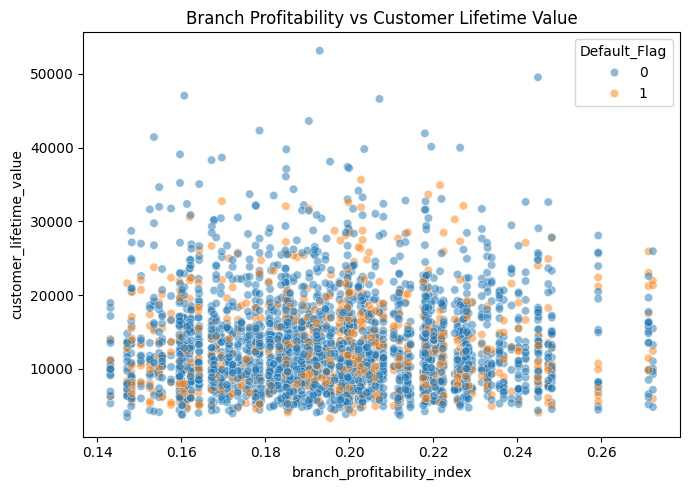
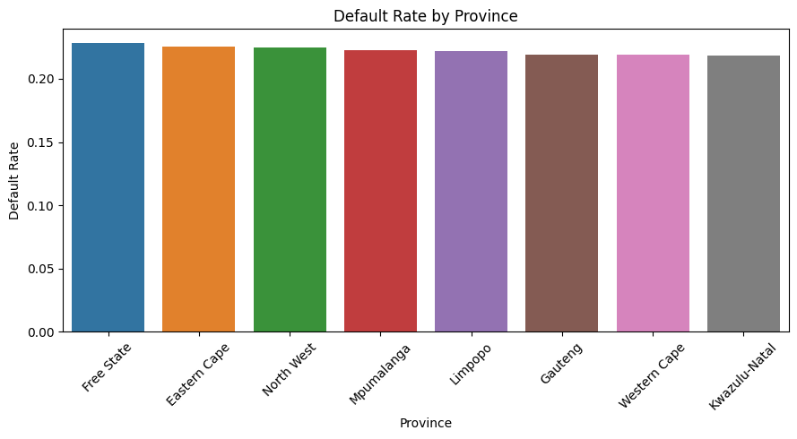
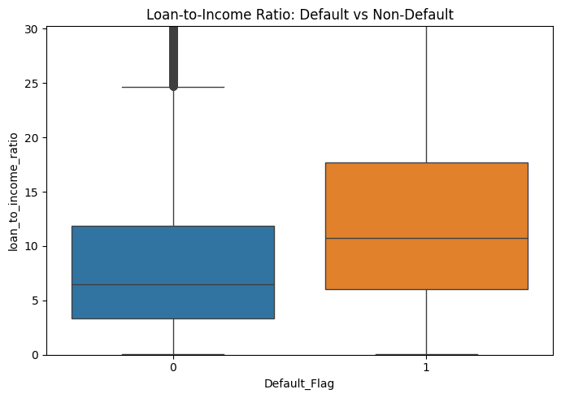
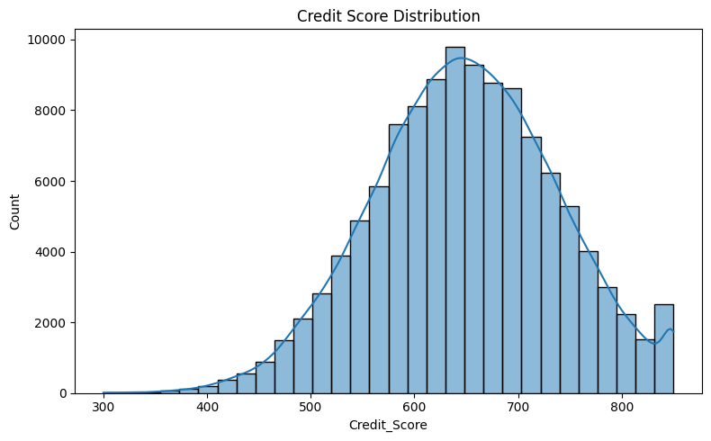
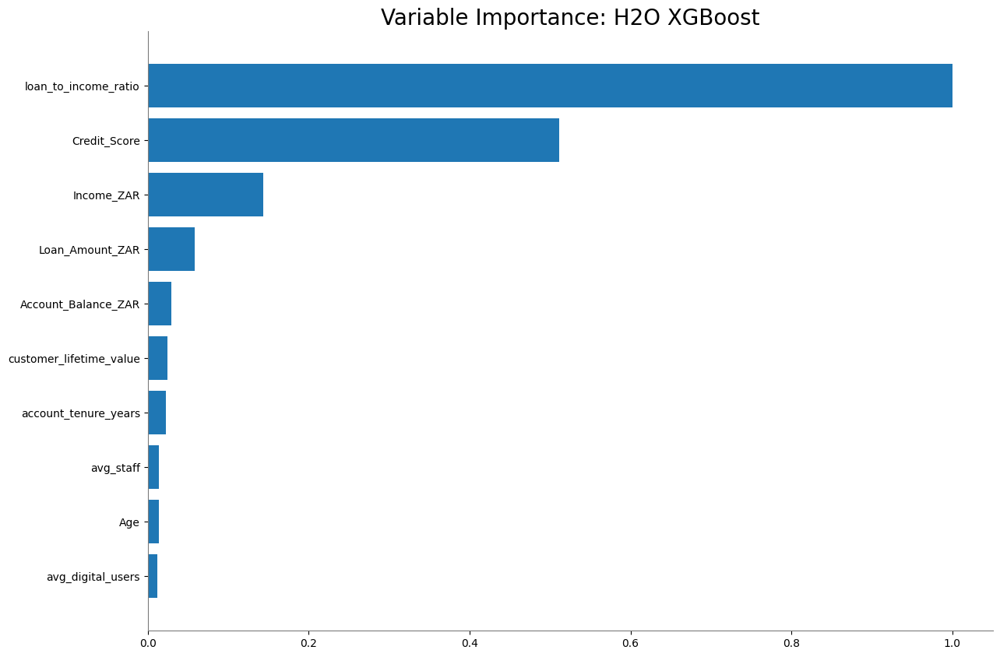

# AI-Powered Banking Intelligence: Loan Default Prediction

Predicting which bank customers are likely to default on a loan, before it happens, using automated machine learning on merged operational and customer data.

## Problem
A South African bank had no way of flagging likely loan defaulters in advance, only after the loss was already made. This project simulates an AI consultancy engagement: merge branch-level operations data with individual customer transaction data, build a predictive model, and turn the result into a policy recommendation a bank's board could actually act on.

## Approach
- Merged two 120,000-row datasets (branch operations and customer transactions) via branch-level aggregation, using Branch_ID as the join key
- Cleaned both datasets, dropping rows with missing values (~3% of rows) rather than imputing, to avoid introducing artificial values into the model
- Engineered a new feature, loan-to-income ratio, not present in either raw dataset, to capture affordability rather than raw loan size alone
- Trained and compared 17 machine learning models using H2O AutoML, with class balancing to correct for a 22% baseline default rate
- Evaluated the best model (a Stacked Ensemble) on accuracy, AUC, and feature importance
- Verified the risk driver was behavioral rather than geographic, default risk was nearly identical across provinces

## Key Finding
The best model achieved 77.9% accuracy and an AUC of 0.673, correctly flagging 71.5% of customers who went on to default, before they defaulted.

Loan-to-income ratio, the engineered feature, drove 44.7% of the model's predictions, more than credit score (20.4%) and raw loan amount (14.2%) combined. This means thoughtful feature engineering added more predictive power than any single raw column in the original data.

## Recommendation
Introduce a loan-to-income ratio threshold into the loan approval process, used to flag applications for mandatory human review, not to auto-reject. Pilot the threshold on a control group before full rollout, and keep lending criteria uniform across provinces since risk here is behavioral, not geographic.

| Metric | Value |
|---|---|
| Accuracy | 77.9% |
| AUC | 0.673 |
| Default-catch rate | 71.5% (3,693 of 5,162 actual defaulters caught) |
| #1 predictor | Loan-to-income ratio (44.7%) |
| #2 predictor | Credit score (20.4%) |
| #3 predictor | Loan amount (14.2%) |
| Models compared | 17 |
| Default rate in dataset | 22% |

## Visuals

## Tools
Python (Pandas), H2O AutoML

## Data
Simulated South African bank operations and customer transaction data (120,000 rows each), provided as part of the FTLAfrica Nova6 capstone.

## Files
- `AI_Powered_Banking_Intelligence.ipynb`: full analysis notebook
- `data/South_Africa_Bank_Operations_120k.csv`, `data/South_Africa_Customer_Transactions_120k.csv`: source datasets
- `charts/`: supporting visualizations

## Author
Oluwapelumi Abigael Oyesanya, Data Analyst
[LinkedIn](https://www.linkedin.com/in/oluwapelumi-oyesanya) · [Email](mailto:abigaeloyesanya@gmail.com)
